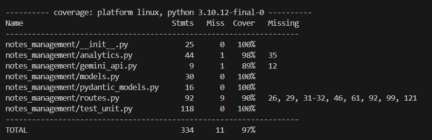

# Notes management system:
Author: <mark>Bohdan Ozarko</mark><br>

# Project is deployed on AWS (amazon web service)
## Vue page: http://3.126.152.192:8080/
## RestAPI endpoint: http://3.126.152.192:8000/ 

## Prerequisites
python3, pip, docker, vue-client, gemini_api_key<br>
### For vue:
```cd ./backend```<br>
```sudo apt install npm```<br>
```npm install @vue/cli-service --save-dev```<br>
### For docker:
```sudo apt update```<br>
```sudo apt install apt-transport-https ca-certificates curl software-properties-common```<br>
```curl -fsSL https://download.docker.com/linux/ubuntu/gpg | sudo gpg --dearmor -o /usr/share/keyrings/docker-archive-keyring.gpg```<br>
```sudo sh -c 'echo "deb [arch=amd64 signed-by=/usr/share/keyrings/docker-archive-keyring.gpg] https://download.docker.com/linux/ubuntu $(lsb_release -cs) stable" > /etc/apt/sources.list.d/docker.list'```<br>
```sudo apt update```<br>
```sudo apt install docker-ce docker-ce-cli containerd.io```<br>

### Create .env file in "notes_management" folder: <br>
```nano ./backend/notes_management/.env```<br>
### Paste in gemini_api key:<br>
```GEMINI_API_KEY = <your_key_here>```
## Prerun

### To run in docker container:<br>
```cd ./backend```<br>
```./run_app.sh```<br>
### App will be available on port 8000<br>
### To run on machine:<br>
```cd ./backend```<br>
```python3 -m venv venv```<br>
```source venv/bin/activate/```<br>
```pip install -r requirements.txt```<br>
```python3 run.py```<br>
### To run frontend:<br>
```cd ./frontend```<br>
```npm run serve```
### Vue is runned on port 8080
### Run pytest
```cd ./backend```<br>
```pytest --cov=notes_management --cov-report=term-missing```<br>
## Usage

### To create new user

```curl -X 'POST' 'http://127.0.0.1:8000/users/' -H 'Content-Type:application/json' -d '{"username": "<user_name>", "password": "<user_password>"}'```
### Responce
```{"id": <user_id>, "username": <user_name>}```
### After that, you can recieve your authorization token
### To recieve token
```curl -X 'POST' 'http://127.0.0.1:8000/token' -H 'Content-Type: application/x-www-form-urlencoded' -d 'username=testuser&password=securepassword'```
### Responce
```{"access_token": <your_token>, "token_type": "bearer"}```
### Having token allows your to manage your notes
### Create note
```curl -X 'POST' 'http://127.0.0.1:8000/notes/' -H 'Authorization: Bearer <your_access_token>' -H 'Content-Type: application/json' -d '{"title": "<note_title>", "content": "<note_content>"}'```
### Responce
```{"id": <note_id>, "title": <note_title>, "content": <note_content>, "summary": <note_summary}```
### By note_id you will be able to modify, delete and get note with it's versions
### Note also gets summary generated by gemini-2.0-flash
### Get note
```curl -X 'GET' 'http://127.0.0.1:8000/notes/<note_id>' -H 'Authorization: Bearer <your_access_token>'```
### Responce
```{"id": <note_id>, "title": <note_title>, "content": <note_content>, "summary": <note_summary>, "updated_at": <note_updated_at>}```
### Modify note
```curl -X 'PUT' 'http://127.0.0.1:8000/notes/<note_id>' -H 'Authorization: Bearer <your_access_token>' -H 'Content-Type: application/json' -d '{"title": "<updated_title>", "content": "<updated_title>"}'```
### Responce
```{"id": <note_id>, "title": <updated_title>, "content": <updated_content>, "summary": <updated_summary>, "updated_at": <updated_updated_at>}```
### Summary is updated with content by gemini-2.0-flash, also old version of note is saved
### Delete note
```curl -X 'DELETE' 'http://127.0.0.1:8000/notes/<note_id>' -H 'Authorization: Bearer <your_access_token>'```
### Responce
```{"message": "Note deleted successfully"}```
### All note versions are deleted as well
### Get versions
```curl -X 'GET' 'http://127.0.0.1:8000/notes/<note_id>/versions' -H 'Authorization: Bearer <your_access_token>'```
### Responce
```[{"id": <version_id>, "title": <version_title>, "content": <version_content>, "summary": <version_summary>, "created_at": <version_creation_datetime>}, {...}, ...]```
### Get analytics
```curl -X 'GET' 'http://127.0.0.1:8000/analytics```
### Responce
```{"total_word_count": total_word_count, "average_note_length": average_note_length,"most_common_words": most_common_words, "top_3_longest_notes": [{"id": <note_id>, "title": <note_title>, "content_length": <content_length>}, ...], "top_3_shortest_notes": [{"id": <note_id>, "title": <note_title>, "content_length": <content_length>}, ...]}```
## PyTest results
